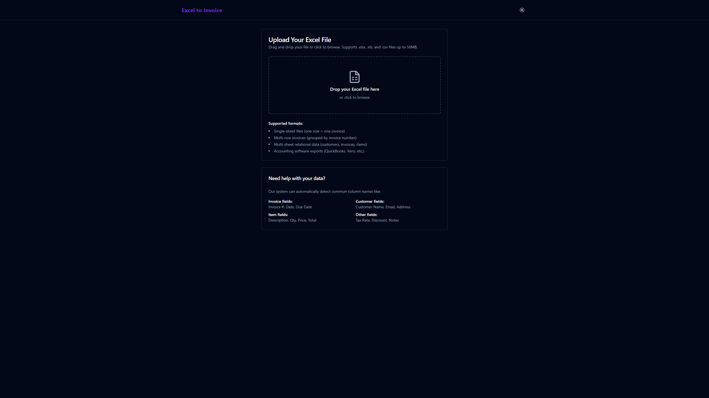
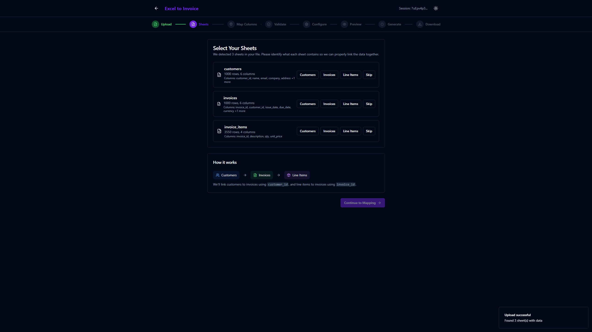
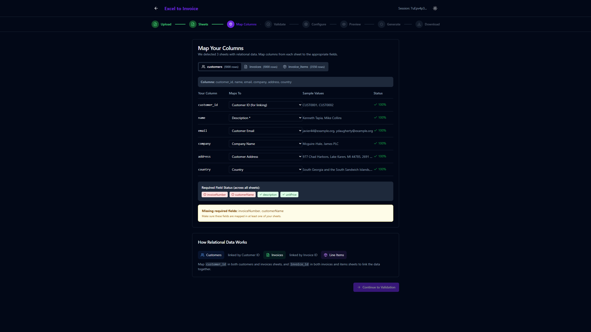
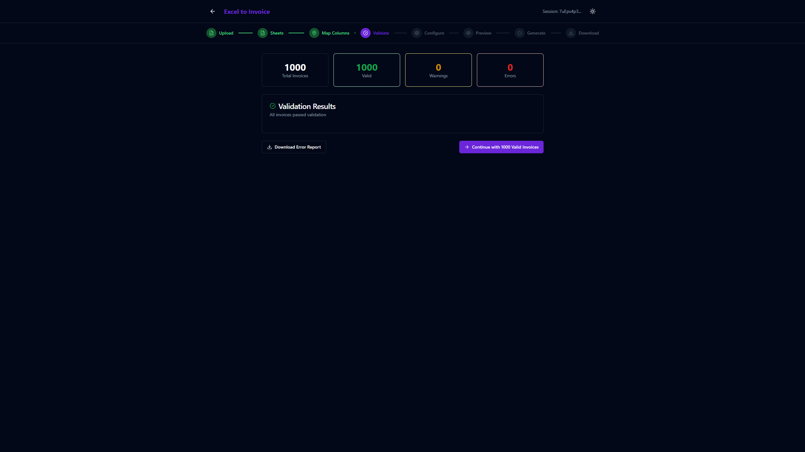
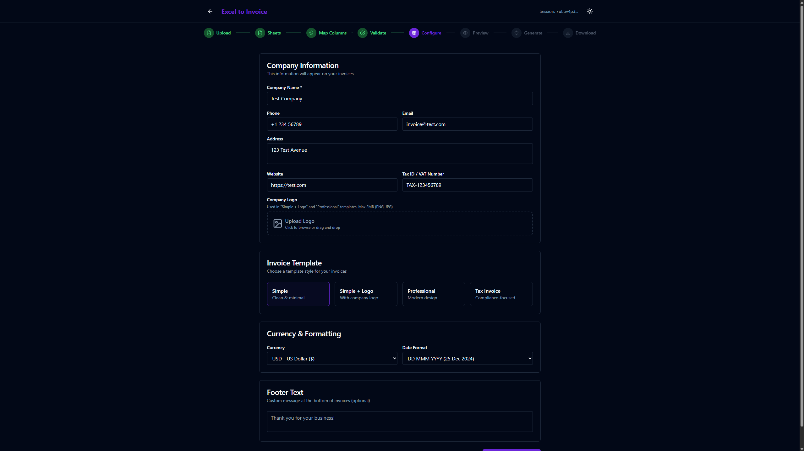
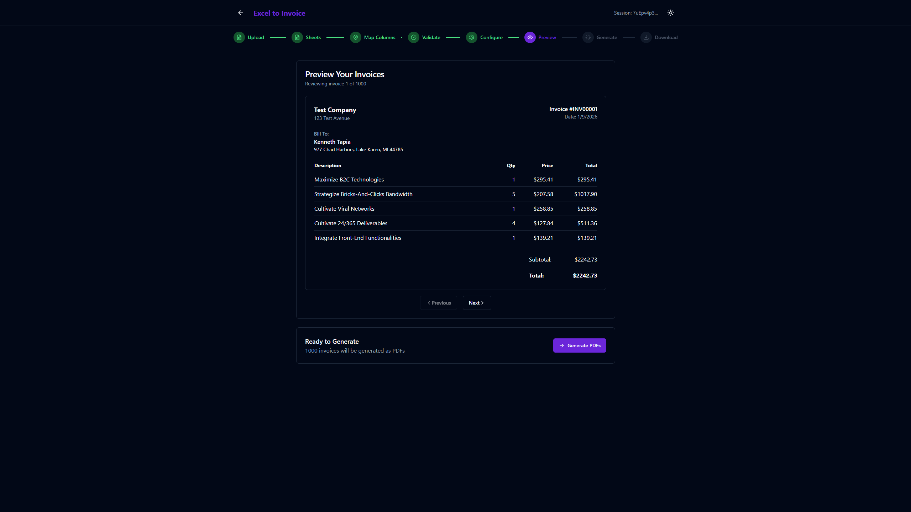
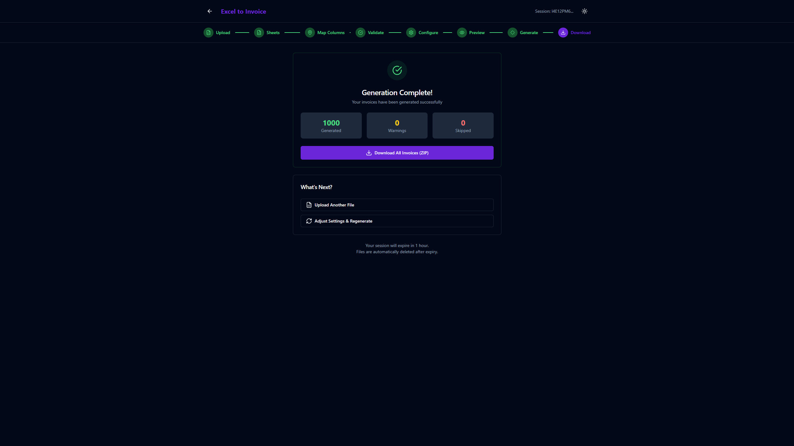

# Excel to Invoice

A web application that transforms Excel spreadsheets into professional PDF invoices in bulk. Perfect for businesses that need to convert invoice data from various sources (manual entry, accounting exports, ERP systems) into branded, professional PDF invoices.

## Demo

<p align="center">
  
</p>

## Features

- **Multi-format Excel Support**: Works with single-sheet files, multi-row invoices, and relational multi-sheet data (customers, invoices, line items)
- **Smart Column Detection**: Automatically detects and maps common column names from QuickBooks, Xero, Zoho, and other accounting software
- **4 Professional Templates**: Simple, Simple + Logo, Professional, and Tax Invoice templates
- **Dark Mode**: Full dark mode support for comfortable use
- **Paid/Unpaid Organization**: Generated PDFs are automatically organized into `paid/` and `unpaid/` folders
- **Real-time Progress**: WebSocket-based real-time progress updates during generation
- **Step Navigation**: Easy navigation between steps to make adjustments

## Screenshots

### Upload Your Excel File


### File Uploaded Successfully


### Map Columns Automatically


### Validate Your Data


### Configure Invoice Settings


### Preview Before Generating


### Download Your Invoices


## Invoice Templates

4 professional templates to choose from:

| Template | Description | Sample |
|----------|-------------|--------|
| **Simple** | Clean, minimal, text-focused | [View PDF](./docs/invoices/Simple.pdf) |
| **Simple + Logo** | Simple with company logo header | [View PDF](./docs/invoices/Simple%20+%20Logo.pdf) |
| **Professional** | Colored header, modern typography | [View PDF](./docs/invoices/Professional.pdf) |
| **Tax Invoice** | Detailed tax breakdown, compliance-focused | [View PDF](./docs/invoices/Tax%20Invoice.pdf) |

## Supported Excel Formats

The application supports 3 different Excel formats. Download sample files to test:

### Format A: Single Sheet (One Row = One Invoice)
[Download Sample](./docs/excel/Format%20A.xlsx)
```
| invoice_no | customer_name | item | qty | price | total |
|------------|---------------|------|-----|-------|-------|
| INV-001    | Acme Corp     | Widget | 2 | 50  | 100   |
```

### Format B: Single Sheet (Multiple Rows = One Invoice)
[Download Sample](./docs/excel/Format%20B.xlsx)
```
| invoice_no | customer_name | item    | qty | price |
|------------|---------------|---------|-----|-------|
| INV-001    | Acme Corp     | Widget  | 2   | 50    |
| INV-001    | Acme Corp     | Gadget  | 1   | 100   |
```

### Format C: Multi-Sheet Relational
[Download Sample](./docs/excel/Format%20C.xlsx)
```
Sheet: customers
| customer_id | name | email | company | address |

Sheet: invoices
| invoice_id | customer_id | issue_date | due_date | status |

Sheet: invoice_items
| invoice_id | description | qty | unit_price |
```

## Tech Stack

- **Frontend**: React 18, TypeScript, Vite, TailwindCSS, shadcn/ui
- **Backend**: Node.js, Express, TypeScript
- **PDF Generation**: Puppeteer (headless Chrome)
- **Real-time Updates**: Socket.IO
- **Excel Parsing**: SheetJS (xlsx)

## Prerequisites

- Node.js 18+
- npm or yarn

## Installation

1. Clone the repository:
```bash
git clone https://github.com/sayedmowafi/Excel2Invoice.git
cd Excel2Invoice
```

2. Install dependencies:
```bash
npm install
```

3. Build the shared package:
```bash
npm run build -w @excel-to-invoice/shared
```

4. Start both servers (API + Web):
```bash
npm run dev
```

This will start:
- **API Server** on http://localhost:3001
- **Web App** on http://localhost:5173

5. Open http://localhost:5173 in your browser

### Alternative: Run Servers Separately

If you prefer to run the servers in separate terminals:

```bash
# Terminal 1 - API Server
npm run dev:api

# Terminal 2 - Web App
npm run dev:web
```

**Note:** Both servers must be running for PDF generation to work!

## Project Structure

```
excel-to-invoice/
├── apps/
│   ├── api/                 # Express backend
│   │   ├── src/
│   │   │   ├── routes/      # API endpoints
│   │   │   ├── services/    # Business logic
│   │   │   │   ├── parser/  # Excel parsing
│   │   │   │   ├── mapper/  # Column detection
│   │   │   │   ├── validator/ # Data validation
│   │   │   │   └── generator/ # PDF generation
│   │   │   └── middleware/  # Express middleware
│   │   └── package.json
│   │
│   └── web/                 # React frontend
│       ├── src/
│       │   ├── components/  # UI components
│       │   ├── pages/       # Page components
│       │   ├── hooks/       # Custom hooks
│       │   └── services/    # API client
│       └── package.json
│
├── packages/
│   └── shared/              # Shared TypeScript types
│
└── package.json             # Monorepo root
```

## Environment Variables

### API (apps/api/.env)

Copy `.env.example` to `.env` and configure as needed:

```env
# Server Configuration
PORT=3001
NODE_ENV=development
CORS_ORIGIN=http://localhost:5173

# Rate Limiting (disabled by default)
RATE_LIMIT_ENABLED=false              # Set to 'true' to enable
RATE_LIMIT_WINDOW_MS=900000           # 15 min window for general API
RATE_LIMIT_MAX_REQUESTS=100           # Max requests per window
RATE_LIMIT_UPLOAD_WINDOW_MS=3600000   # 1 hour window for uploads
RATE_LIMIT_UPLOAD_MAX=10              # Max uploads per hour
RATE_LIMIT_GENERATE_WINDOW_MS=3600000 # 1 hour window for PDF generation
RATE_LIMIT_GENERATE_MAX=5             # Max generations per hour
```

### Web (apps/web/.env)
```env
VITE_API_URL=http://localhost:3001
```

## API Endpoints

| Method | Endpoint | Description |
|--------|----------|-------------|
| POST | `/api/upload` | Upload Excel file |
| GET | `/api/sessions/:id` | Get session info |
| GET | `/api/sessions/:id/columns` | Get column mappings |
| POST | `/api/sessions/:id/map` | Submit column mappings |
| POST | `/api/sessions/:id/validate` | Run validation |
| POST | `/api/sessions/:id/config` | Save generation config |
| POST | `/api/generate/:sessionId` | Start PDF generation |
| GET | `/api/generate/:sessionId/download` | Download ZIP file |

## Configuration Options

- **Company Information**: Name, logo, address, phone, email, tax ID
- **Currency**: 50+ currency options with customizable symbol position
- **Date Format**: Multiple formats (DD/MM/YYYY, MM-DD-YYYY, etc.)
- **Number Format**: Decimal/thousands separators, decimal places
- **Field Visibility**: Toggle display of optional fields
- **Bank Details**: Add payment information to invoices

## License

This project is licensed under a custom non-commercial license.

**You are free to:**
- Share - copy and redistribute the material in any medium or format
- Adapt - remix, transform, and build upon the material

**Under the following terms:**
- **Attribution** - You must give appropriate credit
- **NonCommercial** - You may not use the material for commercial purposes

**For commercial use or licensing inquiries, please contact the author at: sayed@sayedmowafi.dev**

## Disclaimer

This software is provided for educational and personal use only. The author is not responsible for any misuse or damages arising from the use of this software.

## Contributing

This is a portfolio/educational project. Contributions, issues, and feature requests are welcome!

## Author

**Sayed Mowafi**
Email: sayed@sayedmowafi.dev

Created as a portfolio project demonstrating full-stack engineering capabilities.
